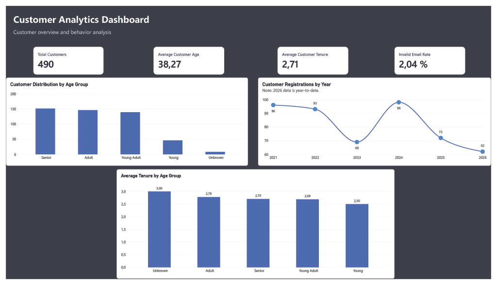

# Customer ETL Pipeline

## Project Overview

This project implements an ETL pipeline that extracts customer data from a CSV file, cleans and transforms the data using Python and Pandas, validates data quality, and loads the final dataset into SQL Server for analysis.

The project simulates a real-world data pipeline where raw customer data must be standardized, validated, and prepared for business analysis.

## Business Questions

The analysis aims to answer the following business questions:

1. What is the current size of our customer base?
2. Which age groups represent the largest share of our customer base?
3. What is the average age of our customers?
4. How long have our customers been registered with the company on average?
5. What percentage of our customer base has an invalid email address?
6. Does customer tenure vary across different age groups?
7. How has customer acquisition evolved over time?
8. What proportion of our customer base consists of new versus long-term customers?

## Project Architecture

The ETL pipeline follows this process:

CSV File > Extract > Transform > Validate > Load > SQL Server > SQL Analysis

## Technologies Used

- Python
- Pandas
- SQLAlchemy
- SQL Server
- T-SQL
- Git
- GitHub

## ETL Process

### Extract

Customer data is extracted from a raw CSV file using Pandas.

### Transform

The raw data is cleaned and transformed through the following steps:

- Standardize customer names
- Clean and validate email addresses
- Convert date fields to a consistent format
- Clean phone numbers
- Calculate customer age
- Classify customers into age groups
- Calculate customer tenure
- Remove duplicate records

### Validate

The transformed dataset is validated before loading it into SQL Server.

The validation process checks for:

- Duplicate records
- Invalid email addresses

Duplicate records prevent the data from being loaded, while invalid emails generate a warning without stopping the pipeline.

### Load

The validated dataset is loaded into SQL Server.

The loading process uses a full-refresh strategy:

1. Truncate the existing target table.
2. Insert the transformed dataset.

## Data Quality

The raw dataset contains 500 records.

After the transformation and deduplication process:

- Raw records: 500
- Final records: 490
- Duplicate records removed: 10
- Invalid emails identified: 10

Invalid email addresses are flagged during the validation process and do not prevent the dataset from being loaded.

## Power BI Dashboard

The dashboard provides an overview of customer demographics, registration trends, customer tenure, and email data quality.

